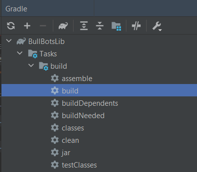
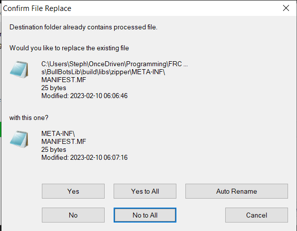

# BullBotsLib
## How to add to an FRC Project
### .jar
In your FRC project, add a folder called `libs`. A .jar file is available in 
[github releases](https://github.com/bullbots/BullBotsLib/releases).  Download it and add it to 
your lib folder.
### build.gradle
Inside your `build.gradle` file, add this to the dependencies:
```
dependencies {
    ...
    implementation fileTree(dir:'libs', include:'BullBotsLib-**version**.jar')
}
```

## How to use in an FRC Project
### Drivetrains ([frc.team1891.common.drivetrains](https://github.com/bullbots/BullBotsLib/tree/main/src/main/java/frc/team1891/common/drivetrains))
BullBotsLib provides 3 drivetrain types (but the ability to add your own by extending `Drivetrain` or 
`HolonomicDrivetrain`)  in order to remove code that would be repeated year to year, and make things as easy as 
possible when getting started.  To use an existing drivetrain, create a class that extends it.

In your constructor you will need to call the super constructor and give it whatever parameters it needs.  It's easiest
to add all the parameters as private static fields in the top of your class.

Once you do that, your drivetrain is ready to go.  All you need to do is configure your motors 
(e.g. `talon.configFactoryDefault()`), as that's not done for you.

You can also call `configureSmartDashboard()` in the constructor (as you can with anything that extends `Subsystem` from
BullBotsLib) to get extra diagnostic information

###### MotorController
`MotorController` is an interface that extends WPILib's `MotorController`, adding functionality of a relative 
encoder.  Basic implementations exist for the TalonFX, TalonSRX, and SparkMax already.  `MotorController` is used within
all drivetrains, except swerve.

###### Swerve
`SwerveDrivetrain` tries to make it as easy as possible to get started with Swerve.  Each `SwerveModule` holds a 
`DriveController` and a `SteerController`, which separates the control over a drive motor and steer motor for easy 
changes.  These classes and basic implementations are found under [frc.team1891.common.drivetrains.swervecontrollers](https://github.com/bullbots/BullBotsLib/tree/main/src/main/java/frc/team1891/common/drivetrains/swervecontrollers).

### User Input ([frc.team1891.common.control](https://github.com/bullbots/BullBotsLib/tree/main/src/main/java/frc/team1891/common/control))
###### Triggers
`AxisTrigger` and `POVTrigger` behave similarly to a `JoystickButton`, in that you can attach commands that can be
scheduled when the trigger activates, but activate based one something other than a simple button press.
###### JoystickRotation2d
A simple class that converts two joystick axes into a `Rotation2d`.

The forward axis on a joystick is conventionally negative; you are responsible for inverting it before feeding it to
this class
###### HID Devices
`Guitar` is a simple user input device that can be connected to a Guitar Hero controller.

`X52ProfessionalHOTAS` is a slightly less simple device, giving the driver access to more buttons than they could ever
need.

### Hardware ([frc.team1891.common.hardware](https://github.com/bullbots/BullBotsLib/tree/main/src/main/java/frc/team1891/common/hardware))
###### NavX
The `NavX` is a simple wrapper class to `AHRS`, ensuring clarity on the units used by the gyro by implementing
`getDegrees()` and `getRadians()` instead of the built-in `getAngle()`.

`SimNavX` is extension of `NavX`, allowing for basic use in a simulator through setter methods, `setDegrees()` and
`setRadians()`.

###### WPI_CANSparkMax
This is a simple wrapper to `CANSparkMax`, making it a `Sendable`.  This is similar to `WPI_TalonFX`.

###### Lazy Motor Controllers and Solenoids
Under [frc.team1891.common.hardware.lazy](https://github.com/bullbots/BullBotsLib/tree/main/src/main/java/frc/team1891/common/hardware/lazy)
there are wrapper classes that override the "set" methods of the given motor controllers and solenoids (e.g. TalonFX or
Solenoid).  The new methods help reduce the weight on the CAN bus from repeated calls of the same command by only
calling the super method when the method parameters are different from before.

### LEDs ([frc.team1891.common.led](https://github.com/bullbots/BullBotsLib/tree/main/src/main/java/frc/team1891/common/led))
The `LEDStrip` exists in order to make controlling LEDs as clean as possible, even with complex animations.  It wraps 
the `AddressableLED` and `AddressableLEDBuffer` classes from WPILib.

The `LEDStrip` can be divided up into smaller segments giving more complex control.  `LEDStripSegment` is the simplest, 
as it just provides the same behavior applied to a subsection of the `LEDStrip`.  `LEDMatrix` allows for control
over a grid of LEDs.  Finally, `LEDMatrixSegment` allows control over a specific section of a parent `LEDMatrix`.  It can even take `org.opencv.core.Mat` (also provided in WPILib) as an input.

The `LEDPattern` and `LedMatrixPattern` interfaces help you create complex animations without messy code.  There is also
an `LEDPatterns` and `LEDMatrixPatterns` classes, which just holds a few example patterns that you can easily use.

### Logging ([frc.team1891.common.logger](https://github.com/bullbots/BullBotsLib/tree/main/src/main/java/frc/team1891/common/logger))
The `BullLogger` is a logger class that uses the `DataLog` class.  It exports its logs to a USB drive plugged into the
roboRIO and optionally also outputs to the console.

### Trajectories ([frc.team1891.common.trajectory](https://github.com/bullbots/BullBotsLib/tree/main/src/main/java/frc/team1891/common/trajectory))
The purpose of this package is to make an easy way to generate a trajectory (`HolonomicTrajectory`) that allows a robot to move in one direction
while facing another direction.

To generate a trajectory, simply call `HolonomicTrajectoryGenerator.generateHolonomicTrajectory(...)`.  There are several
method signatures depending on exactly what you need to do, but
`generateHolonomicTrajectory(List<Pose2d> waypoints, List<Rotation2d> headings, TrajectoryConfig config)` is
recommended.

To generate a command that follows a trajectory like the one above, use
`HolonomicTrajectoryCommandGenerator.generate(...)`.  This time recommending using
`generate(SwerveDrivetrain drivetrain, Pair<Pose2d, Rotation2d> ... posesAndHeadings)` as it allows for the intended
moving in one direction while facing another, with the highest level of control.  For each waypoint you want the robot
to pass through, add a `Pair`, with a `Pose2d` representing the position and direction of movement, and a `Rotation2d`
representing the heading of the robot while it moves through that point.

If you are generating commands as described above, you will need to tune PID values to your specific robot.  This can be
done by calling `HolonomicTrajectoryCommandGenerator.setTranslationalPID(double p, double i, double d)` and
`HolonomicTrajectoryCommandGenerator.setRotationalPID(double p, double i, double d)`.

### Vision ([frc.team1891.common.vision](https://github.com/bullbots/BullBotsLib/tree/main/src/main/java/frc/team1891/common/vision))
###### Limelight
The `Limelight` class wraps the NetworkTables used by Limelight into a more intuitive structure, adding features such as
`isConnected()`, `getLatencyMs()`, and `setPipeline(int pipeline)`

## How to Maintain this Repository - Instructions for Future Bullbots
### Publishing a New Release

#### 1. Update the Version
First, update the version in `build.gradle`:
```gradle
group 'frc.team1891'
version 'YEAR.AA.BB'
```
Generally, increase `AA` for major releases and `BB` for bug fixes and minor releases.

#### 2. Build and Publish to Repository
Run the publish task from the command line:
```bash
./gradlew publishToRepo
```

This will:
- Build all Java, C++, and JNI artifacts
- Generate the vendordep JSON file
- Publish to the local `build/repos/` directory
- Copy everything to the root `repos/` directory for GitHub Pages

After it completes, you'll see next steps printed:
```
Published version YEAR.AA.BB to repos/ directory
Next steps:
  1. git add repos/
  2. git commit -m "Publish BullBotsLib YEAR.AA.BB vendor dependency artifacts"
  3. git push
```

#### 3. Commit and Push
Follow the instructions to commit and push the changes:
```bash
git add repos/
git commit -m "Publish BullBotsLib YEAR.AA.BB vendor dependency artifacts"
git push
```

GitHub Pages will automatically serve the updated artifacts from the `repos/` directory.

#### 4. (Optional) Create a GitHub Release
You can also create a GitHub Release and attach the standalone JAR file from `build/libs/BullBotsLib-**version**.jar` for teams that prefer to use the library without the vendordep system.

### Legacy Build Process (Manual JAR Creation)
<details>
<summary>Click to expand the old manual build process</summary>

To make a build, first select the build version inside `build.gradle`.
```
group 'frc.team1891'
version 'YEAR.AA.BB'
```
I've been pretty messy in what I decide is a major release, and what is a minor release.  But generally you increase `AA`
for major releases, and `BB` for bug fixes and minor releases.

Next, just run the gradle build.  The first time, you'll have to find the task inside the Gradle sidebar, but once you
run it the first time, it will appear at the top near the play button.



After the task runs, you'll find 3 `.jar` files inside `build/libs`:
- `BullBotsLib-**version**.jar`

    This is the main file, technically this is the only one you need in order to have functional code, since it includes
the compiled code.
- `BullBotsLib-**version**-javadoc.jar`

    This file creates an HTML project that includes the documentation of the code project.  To be honest I don't
actually know if this is necessary, but I _think_ this is how you're able to see the code documentation within a code
editor.
- `BullBotsLib-**version**-sources.jar`

  This file contains the source code.  If the above file doesn't provide the code documentation, this one does.  Either
way, this file also allows you to view the code when you ctrl+click from another project.

Since we only want to publish one `.jar` file, we need to unzip these, and repackage them into a single file.  In a file
explorer, we can highlight these three files, and using 7-Zip, unzip them.  When you do this, a prompt will come up,
asking to confirm the file replacement of `MANIFEST.MF`.  Click "No to All".



Once the files are unzipped, we need to re-zip them into a single file.  Highlight all the contents, and use 7-Zip to
"Add to zipper.zip".  You can now rename this file.  Technically the name can be whatever you want, but name it to
`BullBotsLib-**version**`.  When you rename it, change the file type from `.zip` to `.jar`.  This new file can now be
published to GitHub.
</details> 

### Managing Dependencies
Unlike an FRC project, we can't use vendordeps for our dependencies.  We need to manually add and update our dependencies 
in `build.gradle`.  The easiest way to see when dependencies need to be updated, is to run "Manage vendordeps" in an FRC
project, check for updates, then copy those version numbers into this project.  If you find that you need a new 
dependency from WPILib, they can be accessed [here](https://frcmaven.wpi.edu/ui/native/release/edu/wpi/first/).